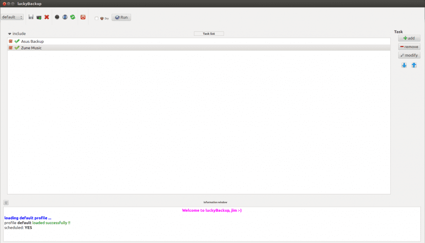
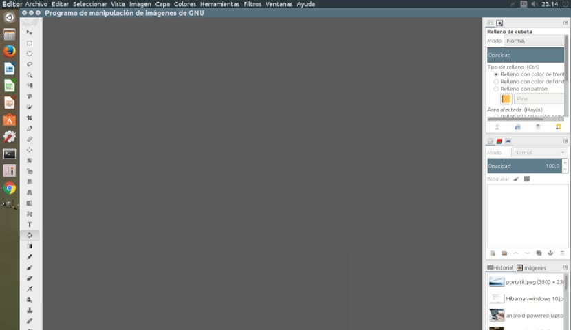
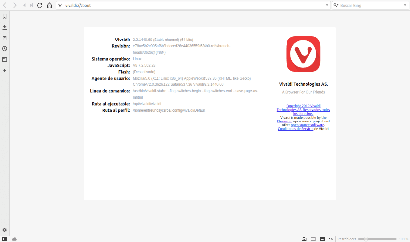

# Web para instalar programas

## Objetivos
    - Crear una pagina para instalar programas en Linux
    - Facilitar la instalación de programas
    - Crear un entorno amigable para la comunidad de Linux
    - Aprender conocimientos de como instalar programas en Linux

### [Instalación LuckyBackups](luckybackup.md)

### [Instalación GIMP](gimp.md)

### [Instalación Vivaldi](vivaldi.md)

