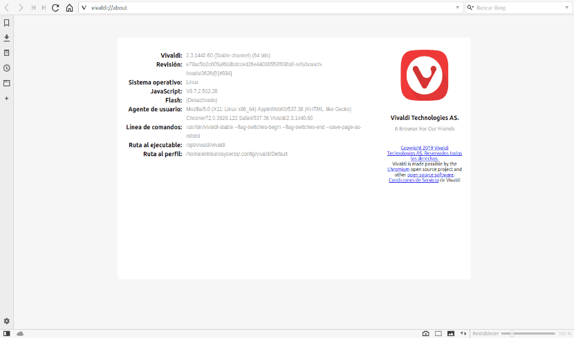

# Instalación Vivaldi en Ubuntu

En el siguiente artículo vamos a echar un vistazo a Vivaldi 2.3. Esta ha sido la primera actualización de este año lanzada para el navegador. Si ya conocías el navegador Vivaldi, sabrás que es un navegador web creado por el fundador de Opera y que busca adaptarse al usuario. Según su página web, este ha sido el objetivo del proyecto desde el principio.

[Vivaldi](https://ubunlog.com/vivaldi-2-nueva-actualizacion-navegador/) **no limita a los usuarios a configuraciones predeterminadas y bloqueadas en nombre de la simplicidad**. De hecho, Vivaldi se basa en una base sólida y extensible que busca brindar al usuario la oportunidad de adaptar el navegador a sus preferencias hasta el mínimo detalle. Esta flexibilidad es lo que hace popular a este navegador.

Se trata de una opción para navegar por la web **fácil de personalizar** y que ofrece algunas opciones interesantes, como agrupar pestañas o tomar notas con capturas de pantalla de páginas completas. También vamos a poder cambiar la apariencia del navegador con temas personalizados, habilitar / deshabilitar las sugerencias de búsqueda y muchas otras opciones.

## Índice
1. Características generales de Vivaldi 2.3
2. Instalar Vivaldi 2.3 en Ubuntu
3. Desinstalar Vivaldi
   
## Características generales de Vivaldi 2.3

- Se trata de una actualización relativamente menor. Vivaldi 2.3 es la primera de este año y la característica estrella de esta actualización son las pestañas que se apilan automáticamente. Esta es una función muy útil para quienes manejamos muchas pestañas al mismo tiempo.
- También se ha mejorado la gestión de pestañas dotándolas de una mayor funcionalidad. Las opciones de administración de las pestañas de Vivaldi nos brindan múltiples formas de acceder y administrar las pestañas de manera efectiva.

- Como ocurría en la versión 2.2, vamos a poder guardar las pestañas seleccionadas como una sesión. La opción de sesiones guardadas nos va a permitir a los usuarios guardar un grupo de pestañas que nos interese volver a abrir más tarde. También nos va a permitir cambiar el nombre de estas sesiones para ayudar a mantenernos organizados a medida que comencemos a trabajar con muchas sesiones.
- En el panel lateral encontraremos un mejor acceso rápido a marcadores y descargas. Además también encontraremos la herramienta para tomar notas y añadir tu propia plantilla de nombre de archivos para las capturas de pantalla, que se hacen con la herramienta integrada.
- El nuevo Vivaldi también nos va ofrecer otras novedades en cuanto a las sugerencias de búsqueda que nos va a mostrar el navegador en el menú desplegable en cuanto se comienza a escribir una URL. Una de ellas es que nos va a permitir elegir si queremos añadir tus favoritos y páginas visitadas recientemente a ese menú.

Estas son solo algunas de las características de Vivaldi 2.3. Se pueden consultar todas las características más en detalle desde la [página web del proyecto](https://vivaldi.com/features/).

## Instalar Vivaldi 2.3 en Ubuntu
Vamos a poder instalar Vivaldi en Ubuntu 18.10 Cosmic Cuttlefish, Ubuntu 18.04 Bionic Beaver, Linux Mint 19.x y otros sistemas derivados de Ubuntu desde repositorio de manera sencilla. Para hacerlo, tendremos que **agregar manualmente el repositorio, descargar e instalar la clave, actualizar el índice del repositorio e instalar el paquete vivaldi-stable**. Para este ejemplo voy a abrir una terminal (Ctrl+Alt+T) de Ubuntu 18.10 y escribir las siguientes líneas:

`sudo add-apt-repository "deb [arch=i386,amd64] http://repo.vivaldi.com/stable/deb stable main"`

Si tras añadir el repositorio vemos en pantalla un **error de GPG** como el que se puede ver en la captura anterior, podemos solucionarlo escribiendo en la misma terminal algo como lo siguiente:

`gpg --keyserver keyserver.ubuntu.com --recv 8D04CE49EFB20B23`

Tras esto ya podemos **actualizar el índice de software disponible**:

`sudo apt-get update`

Terminada la actualización, solo queda **instalar el navegador** escribiendo el comando:

`sudo apt-get install vivaldi-stable`

Otra opción para la instalación de esta versión de Vivaldi es proceder a su **[descarga desde la página web del proyecto](https://vivaldi.com/es/download/)**. Una vez ahí solo hay que descargar el archivo .DEB correspondiente e instalarlo como siempre en nuestro Ubuntu.

## Desinstalar Vivaldi
Para eliminar Vivaldi de nuestro Ubuntu, tan solo hay que abrir una terminal (Ctrl+Alt+T) y escribir en ella:

`sudo apt-get remove vivaldi*`

Vivaldi es uno de los mejores navegadores alternativos para los usuarios que buscan obtener un poco más de la aplicación que utilizan en el día a día para navegar. Esta nueva versión sin grandes cambios, sigue por ese camino.

